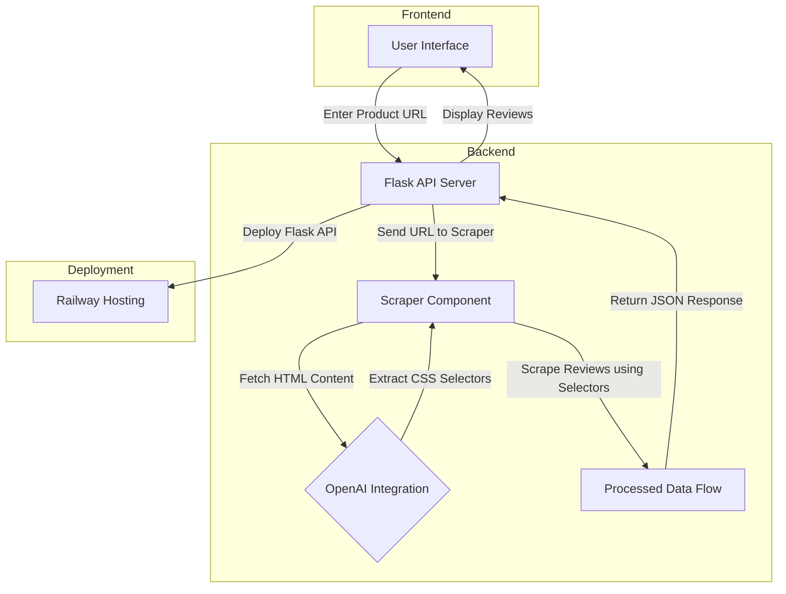

# GoMarble AI Engineer Assignment

## Overview

This project is an API server that extracts review information from product pages. It dynamically identifies CSS selectors for reviews using OpenAI's Large Language Models (LLMs) and employs Selenium for browser automation to handle pagination and retrieve all reviews. The API is designed to work with platforms like Shopify and Amazon.

## System Architecture

The following diagram outlines the flow of the project:


### Explanation:

1. **User Interface (Frontend)**
   - Allows users to enter a product page URL and fetch reviews.

2. **Flask API Server (Backend)**
   - Handles incoming API requests and forwards them to the scraper.

3. **Scraper Component (Selenium)**
   - Automates the extraction of review data from product pages.

4. **OpenAI Integration**
   - Extracts dynamic CSS selectors from HTML content.

5. **Processed Data Flow**
   - Returns extracted review data as JSON.

6. **Deployment (Railway Hosting)**
   - The API server is deployed online for public access.
---

## Features

- **Dynamic CSS Selector Identification**: Uses OpenAI's API to dynamically identify review-related CSS selectors.
- **Browser Automation**: Employs Selenium for headless browser scraping.
- **Pagination Handling**: Automatically navigates through paginated reviews. (I have limited it to 10 pages so that running of the code will not take too long, but this can be changed)
- **Universal Compatibility**: Designed to work with various review pages by adapting dynamically.
- **Deployed API**: The server is deployed on Railway for public access.

---

## API Endpoint

### `GET /api/reviews?page={url}`

- **Parameters**:  
    `page` (required) – The URL of the product page to scrape reviews from.

- **Response Format:**

    ```json
    {
        "reviews_count": 100,
        "reviews": [
            {
                "title": "Review Title",
                "body": "Review body text",
                "rating": 5,
                "reviewer": "Reviewer Name"
            }
        ]
    }
    ```

---

## Prerequisites

- **Python 3.10+**
- **Google Chrome** and **ChromeDriver**
- **OpenAI API Key** (stored in `.env` file)

---

## Installation and Setup

1. **Clone the Repository**
        ```bash
        git clone https://github.com/your-repo-name.git
        cd your-repo-name
        ```

2. **Install Dependencies**
        ```bash
        pip install --no-cache-dir -r requirements.txt
        ```

3. **Set Up the Environment**
        - Create a `.env` file in the root directory:

            ```env
            OPENAI_API_KEY="your_openai_api_key"
            ```

        - Replace your_openai_api_key with your OpenAI API key.

4. **Run the Server**
        ```bash
        python app.py
        ```

5. **Access the API**
        - The API will run at `http://localhost:8080`.

---

## Deployment

The API is deployed on Railway and can be accessed via the live URL:


https://gomarble-test-production.up.railway.app/


## Contact

For any questions or suggestions, please oreach out to me at anshusuresh03@gmail.com
